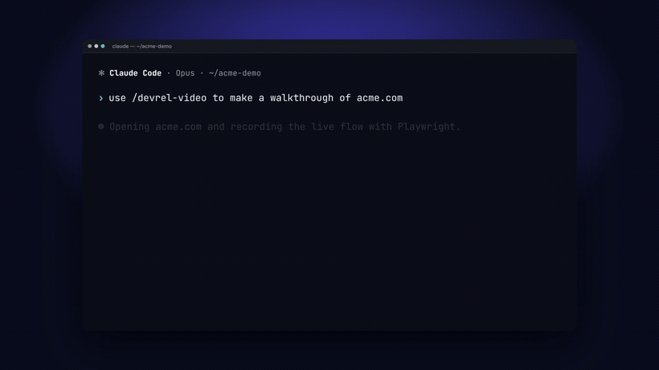
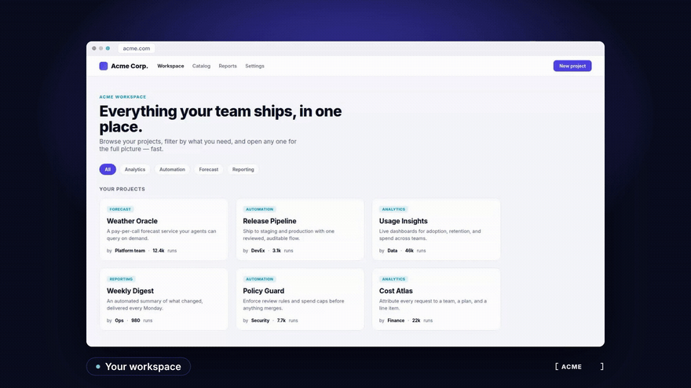

# DevRel Video Studio

Local, Claude Code–driven system that records web-product walkthroughs and composes them into
professional silent demo videos. Capture with **Playwright CLI**, compose + render with **HyperFrames**,
master with **FFmpeg** — orchestrated by the `/devrel-video` skill.

Full design + rationale: [`local-devrel-video-studio-guide.md`](local-devrel-video-studio-guide.md) (v1.2).

## Demos

**Claude Code ⇄ browser** — a prompt in Claude Code drives a live browser capture, then hands the result back,
all in one cut with fade-through-brand transitions ([`example-cli-tour`](projects/example-cli-tour/)) ·
[**▶ watch with sound**](https://youtu.be/lvpKaYUVNws):

[](https://youtu.be/lvpKaYUVNws)

**Narrated product walkthrough** — a self-contained sample app, captured silently, with narration + a music bed +
EN/ES subtitles added by one `variant.sh` command ([`example-walkthrough`](projects/example-walkthrough/)) ·
[**▶ watch with sound**](https://youtu.be/H6npd3uuqls):

[](https://youtu.be/H6npd3uuqls)

## Layout

```
.claude/skills/devrel-video/   # the skill: SKILL.md, templates/, scripts/, references/
brands/<name>/                 # real brand tokens + logo (tokens.json, logo.svg, DESIGN.md)
projects/<slug>/               # one video: brief.yaml, capture.js, index.html, renders/
```

## Quick start

Ask Claude Code: **"use /devrel-video to make a walkthrough of `<URL>`, showing `<flow>`."** It will:

1. **Intake** — fill `projects/<slug>/brief.yaml` from `templates/brief.example.yaml`.
2. **Explore** — open the URL, confirm no login/PII, find stable selectors.
3. **Brand** — `scripts/brand-extract.sh <url> <name>` → `brands/<name>/`.
4. **Capture** — edit `templates/hero-script.js` → `capture.js`; `scripts/capture.sh <capture.js> <url>`.
5. **Compose** — `hyperframes init … --video capture.mp4`; fill `templates/composition.html`.
6. **Render + QA** — `scripts/render-qa.sh projects/<slug>` → master + web copy + ffprobe + contact sheet.

Requirements: Node 22+, FFmpeg, Chromium (see the guide §5). Everything runs locally; telemetry off.

## Example prompts

Paste any of these to Claude Code:

**Without a talking head** (silent or voiceover only):
- **Silent tour** — `use /devrel-video to make a silent walkthrough of https://demo.realworld.io, showing browse → filter by tag → open an article`
- **Narrated** — `use /devrel-video for https://acme.com/app: narrated walkthrough (male voice) + background music + English & Spanish subtitles`
- **Pick / swap the voice** — `…narrate it with voice dan`, or later `regenerate example-walkthrough with voice leah` — the voice is a prompt parameter; each is a new variant (male leo/dan/zac, female leah/tara/jess/mia/zoe — match the presenter). Under the hood one command does it all: `scripts/variant.sh projects/<slug> <voice>` (re-TTS → auto-retime → mix → re-lip-sync the avatar → render) → `renders/out-<voice>.mp4`
- **Reuse a brand** — `use /devrel-video for https://acme.com/pricing using the acme brand; show the plan comparison then the checkout`
- **New brand** — `use /devrel-video for https://acme.com/app — extract the acme brand first, then walk sign-up → dashboard`
- **Local product** — `use /devrel-video on my local app at http://localhost:3000 (start: npm run dev): sign-up → create a project → invite a teammate`

**With a talking head** (presenter bubble at intro/CTA — see [Talking-head avatar](#talking-head-avatar-bring-your-own) below):
- **Narrated + your avatar** — `use /devrel-video for https://acme.com/app: narrated (voice leo) with my talking-head avatar at the intro and CTA. My plate is at ~/Videos/<Org>/DevRel/Talking_Head/<name>/plate.mp4`
- **Avatar at intro only** — `…add my talking-head only at the intro, then let the product run full-screen` (plate as above)
- **Pick the voice** — `…use a male voice — show me leo / dan / zac samples first` (the voice should match the presenter's)

**Terminal + browser** (multi-environment — the demo switches between Claude Code and the web):
- **CLI → browser → CLI** — `use /devrel-video for a tour that starts in Claude Code (prompt: "find me an AI weather agent I can call and pay for"), switches to acme.com/app, then back to Claude Code to pay it over MCP` — terminal beats are captured as real, sanitized Claude Code sessions; beats hand off with a smooth fade through the brand colour. See the re-enactment template [`.claude/skills/devrel-video/templates/cc-terminal.html`](.claude/skills/devrel-video/templates/cc-terminal.html).
- **All in Claude Code** — `…make it entirely inside a Claude Code session — no browser` (one terminal frame for the whole runtime)

**Tweaks** (either mode):
- **Pin an element** — `…open a specific item` (exact `a[href="…"]` in `capture.js`, no fallback)
- **Re-render** — `re-render example-walkthrough with a slower detail scroll and a "Read the docs" CTA`
- **Different length** — `make it ~45s with four chapters`, or `cut a 15s teaser`

The skill gathers anything it still needs (audience, the one message, approved claims, and — for an avatar — your plate path) before recording.

## Worked example

`projects/example-walkthrough/` — a ~24s silent tour of a public demo app (browse → filter by tag → open an
article), framed and chaptered with the pipeline and branded with the default **Acme** placeholder brand.
See its README for the exact commands — swap the URL and brand for your own.

## Optional layers (all supported)

Music, narration (Orpheus TTS — male `leo`/`dan`/`zac` or female `leah`/`tara`/`jess`/`mia`/`zoe`; match it to
your presenter), a **face-only presenter avatar** (LatentSync on your own GPU host, lip-synced, shown briefly at
intro/CTA), multi-language subtitles, and **multi-environment demos** that switch between Claude Code (terminal)
and the browser — steps 5.4–5.8 of the skill. Still on the roadmap: portrait/social output profiles. Details in
[`.claude/skills/devrel-video/references/production-notes.md`](.claude/skills/devrel-video/references/production-notes.md).

## Music & voice

Both are prompt-selectable — set them in the brief's `audio:` block, or on the command.

**Music bed** — six local, license-clean styles (`scripts/gen-bgm.py`; default **`corporate`**). Pick one with
`BGM_STYLE=<style>` or `audio.music: <style>` in the brief:

| Style | Feel |
|---|---|
| `corporate` *(default)* | Clean, optimistic, steady — classic product-demo |
| `ambient` | Slow, warm pad + Rhodes, no drums — premium / focused |
| `lofi` | Mellow chords + soft beat — cozy, friendly |
| `uplift` | Bright pad + arpeggio + light beat — energetic |
| `minimal` | Sparse keys + pad swells — airy, elegant |
| `focus` | Pad + pulsing bass, minimal melody — subdued, technical |

Audition any style: `scripts/gen-bgm.py sample.wav 15 <style>`.

**Narration voice** — the reference TTS (Orpheus) offers male `leo` / `dan` / `zac` and female `leah` / `tara` /
`jess` / `mia` / `zoe`. Set `audio.narration: <voice>` in the brief, or swap after the fact with one command:
`scripts/variant.sh projects/<slug> <voice>` (match the voice to your presenter). Narration needs a TTS
endpoint — see [`scripts/_env.sh`](.claude/skills/devrel-video/scripts/_env.sh).

## Talking-head avatar (bring your own)

The presenter bubble is **your own face** — you supply the recording; this studio never bundles a face.

**Privacy.** Your talking-head footage lives **outside this repo**, e.g. `~/Videos/<Org>/DevRel/Talking_Head/<name>/`,
and is referenced from `brief.yaml` (`avatar_plate:`). Nothing derived from it is committed either — the generated
bubbles (`projects/<slug>/avatar-*.mp4`) and rendered videos are gitignored. **This repo is public; keep faces out of it.**

**Required format** (one clip is enough to start):
- **Sit still**, look at the lens, and **talk naturally** for ~30–60s. The words don't matter — only your face and
  mouth motion are used; the narration is re-synced on top.
- Face front-on, filling a good part of the frame; **even lighting** (no hard shadow across the mouth); nothing over the mouth.
- 1080p+ (720p is fine), **any fps** (the pipeline normalizes to 25 fps, LatentSync's rate). No green screen — the bubble is a circular crop.

Drop the file in your Talking_Head folder, point `avatar_plate:` at it, and the skill lip-syncs it to the narration
at the intro/CTA — regenerated from your local copy each render.
