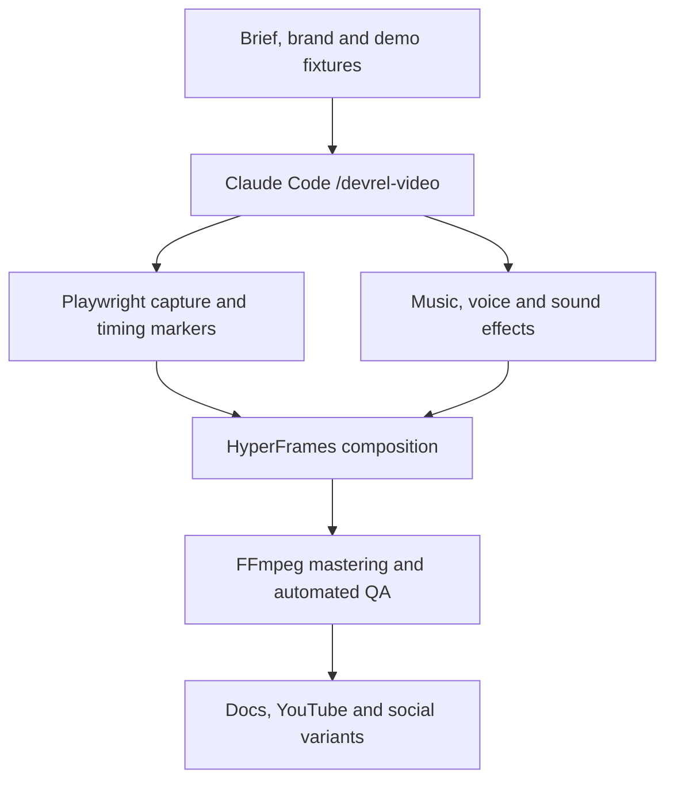

# Local DevRel Product Video Studio

> Implementation guide for building a local, Claude Code-driven system that records repeatable web-product walkthroughs and turns them into professional documentation, DevRel, launch, and promotional videos.

- Guide version: 1.1
- Prepared: 2026-08-26
- Primary platform: Ubuntu/Linux
- Primary stack: Claude Code + Playwright CLI + HyperFrames (first-party skills) + FFmpeg
- v1.1 changes: verified every tool, command, and API against source (Aug 2026); lean on HyperFrames first-party skills; dropped the redundant third-party Product Launch Motion from the default path; folded audio into `/media-use`; separated capture *reproducibility* from render *determinism*; made CDN vendoring an enforced QA step; capture scripts are `.js` (run-code executes JavaScript).
- v1.2 changes (spike-verified end-to-end on Ubuntu 26.04): the full pipeline runs locally with no blockers. Capture needs `PLAYWRIGHT_MCP_SANDBOX=false` on AppArmor/userns-restricted hosts; HyperFrames render needs no sandbox flag. `hyperframes init` requires `--example|--video|--audio` plus `--non-interactive` for agents. Distinguished the two capture modes — `hyperframes capture <URL>` (static screenshots + brand tokens) vs Playwright `page.screencast` (live interaction video). HyperFrames' built-in local-AI fallbacks are MusicGen/Kokoro/whisper-cpp.
- Primary output: MP4, with optional WebM, GIF, poster frames, and social variants

## 1. Goal

Build a reusable local system that can:

1. Inspect a web product, its design system, documentation, and approved claims.
2. Plan a concise product story for a defined audience.
3. Seed stable, synthetic demo data in a dedicated demo environment.
4. Record repeatable browser walkthroughs with Playwright.
5. Turn raw captures into a professional video with:
   - animated title and chapter cards;
   - camera moves, zooms, highlights, cursor animation, and callouts;
   - branded typography, colours, logo treatment, and transitions;
   - optional narration, captions, music, and sound effects;
   - a final call to action.
6. Review and verify the delivered video automatically.
7. Render different outputs from the same project:
   - documentation walkthrough;
   - narrated DevRel tutorial;
   - 30–90 second launch or promotional film;
   - 16:9, 9:16, square, GIF, and poster-frame variants.

The target style is “show, do not tell”: short feature chapters, clear interface proof, restrained copy, smooth motion, and a soundtrack capable of carrying a silent story.

## 2. Recommended architecture



The system has four essential components:

1. **Playwright CLI** records reproducible browser flows (WebM, via its `page.screencast` capture API).
2. **HyperFrames** composes and renders the final motion design, using its own first-party skills for creative direction (`/product-launch-video`, `/hyperframes-creative`) and for all media (`/media-use`).
3. **FFmpeg/ffprobe** encodes, masters, inspects, and packages the media.
4. **A custom Claude Code `/devrel-video` skill** — a *thin* wrapper that adds only company-specific rules (brand lock, approved claims, demo-data safety, QA gates) and delegates capture to Playwright CLI and composition/audio to HyperFrames. It must not reimplement what those skills already provide.

## 3. Local versus offline

The following operations can run locally:

- product startup and fixture preparation;
- browser control and recording;
- video composition and rendering;
- media conversion, audio mixing, and validation;
- Whisper-based transcription;
- local TTS and music generation when local models are selected.

Claude Code itself normally communicates with Anthropic's model service. Therefore, “local” in this guide means that product execution, media assets, recording, rendering, and optional AI media models are local. Treat any code or files exposed to Claude Code according to your organisation's AI-data policy.

## 4. Core tools and skills

| Component | Purpose | Required |
| --- | --- | --- |
| Claude Code skills | Repeatable orchestration and company-specific production rules | Yes |
| HyperFrames core skills | HTML/CSS/GSAP compositions, animation, preview, and rendering | Yes |
| `/product-launch-video` | Product website, brief, or script to launch/demo workflow (first-party) | Yes |
| `/hyperframes-creative` | Creative direction: palettes, typography, narration, beat planning (first-party) | Promotional videos |
| `/media-use` | Media OS: BGM/SFX/voice sourcing + generation, transcription, captions, asset ledger (first-party) | Per format |
| Microsoft Playwright CLI skill | Browser control, repeatable capture, overlays, and screenshots | Yes |
| FFmpeg and ffprobe | Conversion, audio, encoding, compression, and technical QA | Yes |
| Chromium | Browser used for stable product capture | Yes |
| Dedicated demo environment | Safe, reproducible, synthetic product state | Yes |
| Local or licensed audio | Soundtrack, narration, and UI sound design (managed via `/media-use`) | Per format |

### 4.1 HyperFrames

HyperFrames is the preferred compositor because it is:

- designed for coding agents;
- based on plain HTML, CSS, and seekable animation;
- locally rendered and deterministic;
- equipped with a browser Studio and timeline;
- Apache 2.0 licensed without a per-render commercial threshold;
- capable of landscape, portrait, square, 4K, 30/60 fps, and Docker rendering.

Relevant official skills:

- `/hyperframes`: capability router.
- `/product-launch-video`: website, brief, or script to product video.
- `/hyperframes-core`: composition format and determinism.
- `/hyperframes-animation`: motion, transitions, GSAP, Lottie, and Three.js.
- `/hyperframes-keyframes`: frame-accurate, seek-safe animation.
- `/hyperframes-creative`: direction, type, colour, beats, and story.
- `/hyperframes-cli`: init, lint, check, preview, render, and diagnostics.
- `/media-use`: local media, TTS, music, SFX, transcription, and asset tracking.
- `/hyperframes-audio`: music ducking, audio groups, EQ, dynamics, and limiting.
- `/hyperframes-registry`: reusable blocks such as captions, charts, overlays, and transitions.

Official source: <https://github.com/heygen-com/hyperframes>

HyperFrames was pre-1.0 when this guide was written. Pin the version that passes your acceptance suite and commit the installed skills to your repository. Do not update the renderer and skills automatically in an established production branch.

### 4.2 Playwright CLI

Playwright CLI should create the raw walkthrough assets. It supports:

- stable role, test-id, CSS, and generated locators;
- fixed browser viewport and persistent authentication state;
- video recording and screenshots;
- custom HTML overlays and chapter cards;
- action callouts and target highlighting;
- deliberately paced typing;
- saved browser sessions;
- request mocking and network inspection;
- headed sessions and a live dashboard.

Official source: <https://github.com/microsoft/playwright-cli>

Recording reference: <https://github.com/microsoft/playwright-cli/blob/main/skills/playwright-cli/references/video-recording.md>

Use its baked-in chapters and callouts for rapid documentation videos. For marketing-quality outputs, keep raw capture clean and implement titles, zooms, cursor, and callouts in HyperFrames so they remain editable.

**Two capture modes — pick by intent (spike-verified):**

- *Interaction walkthrough* (real clicking/typing — the DevRel default, and the "show, don't tell" reference style): Playwright `page.screencast` records the actual UI in motion to WebM. This is the only path that shows the product being *used*.
- *Static site showcase* (camera over stills): HyperFrames' own `hyperframes capture <URL>` grabs screenshots + brand tokens; the first-party `/product-launch-video` skill uses this and animates a camera over the captured plate — no Playwright needed.

Convert the Playwright WebM → MP4 (H.264, `+faststart`) with FFmpeg before embedding it in a HyperFrames composition: the deterministic renderer seeks MP4 frames more reliably than VP8/WebM. Note that `/product-launch-video` auto-captures the URL in its own Step 1 and is a heavy multi-step orchestrator — for an interaction walkthrough, record with Playwright and hand HyperFrames the resulting MP4 (e.g. `hyperframes init --video demo.mp4`) rather than letting it screenshot the site.

### 4.3 Creative direction (first-party)

Creative direction and quality discipline come from HyperFrames' own skills — no separate product-recording system is needed:

- `/product-launch-video` drives the website/brief/script → launch-film workflow (feature announcements, sizzles, hero videos).
- `/hyperframes-creative` supplies the direction layer: `frame.md`/`design.md`, palettes, typography, narration, beat planning, and composition patterns.
- `/hyperframes-audio` handles sound arithmetic, loudness, and cue verification; `/media-use` sources and generates the audio itself.
- The delivered-file frame inspection and iterative-direction discipline lives in this guide's own §14 QA gates.

A simple documentation walkthrough does not need every cinematic technique — reach for these only for promotional work.

> The third-party `AbubakrChan/product-launch-motion` skill covers similar ground (three competing directions, a claims truth pass, word-locked voiceover). It **overlaps the first-party skills above**, so it is not part of the default path — see §17 (Optional tools). Adopt it only if the first-party creative direction proves insufficient, and audit its SKILL.md/hooks/scripts first.

### 4.4 FFmpeg and ffprobe

Use FFmpeg for:

- WebM-to-MP4 conversion;
- resolution, aspect-ratio, and frame-rate normalisation;
- H.264/H.265/AV1 encoding as appropriate;
- audio mixing, ducking, fading, EQ, loudness normalisation, and limiting;
- poster frames and contact sheets;
- black-frame and silence detection;
- web-friendly `faststart` metadata;
- delivery-size compression.

Use ffprobe for:

- codec inspection;
- dimensions and frame rate;
- audio sample rate and channel layout;
- exact media duration;
- missing streams or malformed output.

## 5. Initial Ubuntu setup

### 5.1 Requirements

- Node.js 22 or newer.
- npm, pnpm, or another supported Node package manager.
- Python 3.11 recommended for optional local audio models.
- FFmpeg.
- Chromium or Chrome.
- Git.
- Claude Code.

The core browser/video pipeline does not require a GPU. A GPU is only needed for optional local voice, image, or music models. A 16 GB AMD GPU has adequate capacity for many of these models, but the exact ROCm compatibility of the installed card and PyTorch build must be validated separately.

### 5.2 System packages

```bash
sudo apt-get update
sudo apt-get install -y ffmpeg chromium-browser git fonts-inter fonts-jetbrains-mono
```

On Ubuntu versions where `chromium-browser` is delivered only as a Snap, either use that package or install Google Chrome and configure Playwright to use it. Confirm the actual executable path before hard-coding it.

Validate:

```bash
node --version
npm --version
ffmpeg -version
ffprobe -version
chromium-browser --version || chromium --version || google-chrome --version
claude --version
```

### 5.3 Install Playwright CLI and its skill

```bash
npm install -g @playwright/cli@latest
playwright-cli install --skills
```

Install `@playwright/cli` as a real command (global as above, or a project-local dependency) rather than invoking it through a bare per-command `npx`: the persistent browser session that ties `open` → `run-code` → `close` together does not survive separate `npx` processes. On AppArmor/userns-restricted hosts (Ubuntu 23.10+, where `apparmor_restrict_unprivileged_userns=1`), export `PLAYWRIGHT_MCP_SANDBOX=false` so capture can launch Chromium; HyperFrames' own render path (chrome-headless-shell) needs no such flag.

If Playwright reports that Chromium is missing:

```bash
npx playwright install chromium
```

Validate:

```bash
playwright-cli --help
playwright-cli open https://example.com --headed
playwright-cli screenshot --filename=example.png
playwright-cli close
```

### 5.4 Install HyperFrames skills

For the first evaluation:

```bash
npx hyperframes telemetry disable
npx hyperframes skills update
npx hyperframes skills update product-launch-video
```

After the prototype works:

1. Record the exact CLI version.
2. Pin that version in `package.json`.
3. Commit `package-lock.json` or the equivalent lockfile.
4. Commit or vendor the installed project-level skills.
5. Run upgrades on a separate branch against the acceptance suite.

Validate:

```bash
npx hyperframes doctor
# init is non-interactive for agents and REQUIRES a source: --example, --video, or --audio
HYPERFRAMES_SKIP_SKILLS=1 npx hyperframes init hyperframes-smoke-test --example swiss-grid --non-interactive
cd hyperframes-smoke-test
npx hyperframes lint
npx hyperframes preview
```

(`--example blank` gives an empty starter; `swiss-grid`/`warm-grain` render something visible. `HYPERFRAMES_SKIP_SKILLS=1` stops `init` from reaching GitHub to refresh skills — use it for offline/CI runs.)

Stop the preview when finished:

```bash
npx hyperframes preview --stop
```

### 5.5 Disable external publishing and telemetry

For confidential product projects:

```bash
npx hyperframes telemetry disable
export HYPERFRAMES_NO_TELEMETRY=1
export DO_NOT_TRACK=1
```

Persist these variables in the project runner or shell environment if appropriate.

Do not run the following for confidential projects:

- `hyperframes publish`;
- `hyperframes feedback`;
- a public issue-upload workflow;
- public preview or cloud-render commands;
- skills that upload project assets without explicit approval.

Keep remote fonts, CDN scripts, and external media out of the final composition. HyperFrames scaffolds and examples pull libraries such as GSAP from a CDN by default, so vendoring is an active step you must perform on every composition, not a default — vendor all required files in the project.

### 5.6 Optional: Product Launch Motion (deferred)

Not part of the default install — HyperFrames' first-party `/product-launch-video` and `/hyperframes-creative` cover this ground (see §4.3). Install it only if you later find the first-party creative direction insufficient. If you do, review the repository and its scripts first, then run:

```bash
npx skills add AbubakrChan/product-launch-motion
```

Restart Claude Code so the skill is discovered.

## 6. Repository structure

Create a dedicated repository rather than mixing video assets directly into the web application's source tree.

```text
devrel-video-studio/
├── .claude/
│   ├── settings.json
│   └── skills/
│       └── devrel-video/
│           ├── SKILL.md
│           ├── references/
│           │   ├── production-rules.md
│           │   ├── copy-style.md
│           │   ├── qa-checklist.md
│           │   ├── output-profiles.md
│           │   └── security-rules.md
│           ├── templates/
│           │   ├── silent-demo/
│           │   ├── narrated-devrel/
│           │   └── product-launch/
│           └── scripts/
│               ├── seed-demo-data.ts
│               ├── capture.js
│               ├── create-contact-sheet.sh
│               └── verify-output.sh
├── brands/
│   └── company/
│       ├── DESIGN.md
│       ├── brand.json
│       ├── logo.svg
│       ├── fonts/
│       ├── music/
│       ├── sfx/
│       └── licences/
├── templates/
│   ├── silent-product-demo/
│   ├── narrated-devrel/
│   └── feature-launch/
├── projects/
│   └── example-video/
│       ├── brief.yaml
│       ├── approved-claims.yaml
│       ├── storyboard.md
│       ├── capture.js
│       ├── markers.json
│       ├── asset-ledger.yaml
│       ├── raw/
│       ├── composition/
│       ├── review/
│       └── renders/
├── scripts/
├── package.json
├── package-lock.json
├── .env.example
├── .gitignore
└── README.md
```

Recommended Git policy:

- Commit skills, scripts, templates, brand definitions, and small reusable assets.
- Keep `.env`, credentials, browser profiles, and storage-state files out of Git.
- Do not commit production-derived data.
- Use Git LFS for large approved binary assets if versioning them is necessary.
- Otherwise ignore raw captures and final renders, or archive them in an approved media store.

## 7. Brand profile

Create `brands/company/DESIGN.md` before making production videos. It should contain:

### 7.1 Immutable brand elements

- Exact logo files and approved variants.
- Primary, secondary, neutral, success, warning, and error colours.
- Approved gradients.
- Primary and monospace fonts, including local font files.
- Logo clear-space and minimum-size rules.
- Product-name capitalisation and terminology.
- Approved URLs and CTA language.

### 7.2 Video-specific translation

- Background treatments suitable for a video frame.
- Heading, body, label, caption, and stat sizes at 1920×1080.
- Equivalent values for 1080×1920 and square compositions.
- Browser-window frame treatment.
- Cursor shape, size, outline, shadow, click ripple, and motion easing.
- Highlight and callout style.
- Chapter-card layout.
- Transition vocabulary and prohibited transitions.
- Soundtrack mood and acceptable intensity.
- UI tick, whoosh, success, and error sound treatment.
- Lower-third and caption style.
- CTA layout and minimum screen duration.
- Safe areas for YouTube, LinkedIn, Instagram, TikTok, and embedded documentation.

Extract existing values from:

- CSS custom properties;
- Tailwind configuration;
- Storybook;
- Figma variables and components;
- design-system packages;
- the product's SVG and font assets.

Claude must not invent a new palette or font merely to make a video look cinematic.

## 8. Video project manifest

Each project should have one source-of-truth manifest, for example `brief.yaml`:

```yaml
id: payments-api-launch
mode: silent-demo
audience: developers-evaluating-agent-payments
one_claim: "Add paid access to an AI agent in minutes"
cta: "Start building at docs.example.com"
duration_target_seconds: 55
language: en
brand: company
product:
  start_command: "npm run dev"
  base_url: "http://localhost:3000"
  demo_tenant: "video-demo"
capture:
  viewport:
    width: 1600
    height: 900
  browser: chromium
  auth_state: ".secrets/demo-storage-state.json"
  fixture: "fixtures/payments-api-launch.json"
chapters:
  - id: create-plan
    title: "Define how customers pay"
    capture: "captures/create-plan.webm"
  - id: protect-endpoint
    title: "Protect the agent endpoint"
    capture: "captures/protect-endpoint.webm"
  - id: inspect-usage
    title: "See every paid request"
    capture: "captures/inspect-usage.webm"
audio:
  narration: false
  soundtrack: "brands/company/music/upbeat-technology-01.wav"
  sfx: true
outputs:
  - profile: docs-16x9
  - profile: marketing-16x9
  - profile: social-9x16
```

Also create `approved-claims.yaml` listing every number, customer name, testimonial, benchmark, price, and performance claim allowed to appear. Claude must reject or flag any unapproved factual claim rather than inventing one.

## 9. Custom Claude Code skill

Create `.claude/skills/devrel-video/SKILL.md` with the following responsibilities.

### 9.1 Trigger conditions

Use the skill when the user asks to:

- create a product demo, feature walkthrough, release video, or DevRel tutorial;
- record a web-product flow;
- create a marketing, documentation, launch, or social video from product assets;
- update or re-render an existing video project.

### 9.2 Main command

Expose:

```text
/devrel-video
```

The command should accept or gather:

- project/product directory;
- base URL and start command;
- audience;
- one claim;
- CTA;
- target duration;
- language;
- format: `silent-demo`, `narrated-devrel`, or `product-launch`;
- output profiles;
- fixture and demo account;
- approved claims;
- brand profile.

### 9.3 Skill phases

#### Phase 1: intake

1. Confirm the audience, one claim, and CTA.
2. Determine whether the video is documentation, narrated DevRel, or promotional.
3. Inspect existing brand and product assets.
4. Identify missing decisions instead of silently guessing.

Output:

- `brief.yaml`;
- `approved-claims.yaml`;
- asset requirements;
- proposed target formats.

#### Phase 2: creative direction

For promotional work:

1. Invoke `/product-launch-video` and `/hyperframes-creative` for the direction discipline.
2. Propose three genuinely different directions.
3. Compare them against audience, claim, available assets, and brand.
4. Select or ask the user to select one.
5. Define one signature motion idea.

For documentation:

1. Use the established documentation template.
2. Keep transitions and copy restrained.
3. Prioritise legibility and accurate product state.

Output:

- `direction.md`;
- `storyboard.md`;
- scene and chapter plan.

#### Phase 3: safety and fixtures

1. Refuse production customer data.
2. Use a dedicated demo tenant.
3. Generate synthetic names, transactions, agents, plans, and API activity.
4. Freeze dates, clocks, random values, and external dependencies when practical.
5. Store secrets outside the repository.
6. Validate that no credential appears visually in the planned flow.

Output:

- fixture file;
- reset/seed command;
- dedicated browser authentication state.

#### Phase 4: capture planning

1. Explore the product with Playwright.
2. Generate stable role/test-id locators.
3. Create one explicit hero script per chapter.
4. Define pauses and semantic markers.
5. Determine where actual product animation should remain enabled.
6. Remove or hide chat widgets, notifications, timestamps, and irrelevant controls.

Output:

- `capture.js` or one capture script per chapter (run-code executes JavaScript, so use `.js`);
- `markers.json` schema;
- capture checklist.

#### Phase 5: capture

1. Start/reset the product and seed fixture data.
2. Load the dedicated storage state.
3. Record at a fixed viewport.
4. Use visible typing rather than instantaneous fill where it helps comprehension.
5. Pause after meaningful product state changes.
6. Produce clean clips and screenshots.
7. Save semantic event timing separately.
8. Repeat a capture that contains layout shifts, cursor mistakes, real data, loading failures, or accidental UI.

Output:

- `raw/*.webm`;
- `raw/*.png`;
- `markers.json`;
- capture log.

#### Phase 6: composition

1. Invoke the correct HyperFrames workflow.
2. Vendor product footage, logo, fonts, music, and scripts locally.
3. Build title cards, chapter cards, browser frames, highlights, camera moves, and CTA.
4. Use a fake video cursor where required; do not depend on the invisible OS cursor in the recording.
5. Use semantic markers to place zooms, annotations, and sound cues.
6. Ensure every scene resolves before its cut.
7. Apply captions and word-level cues only after final narration exists.

Output:

- valid HyperFrames project under `composition/`;
- `asset-ledger.yaml`;
- draft render.

#### Phase 7: review

1. Run HyperFrames lint/check.
2. Open HyperFrames Studio.
3. Ask the user to review the storyboard or timeline.
4. Extract frames at every chapter, important interaction, transition, and CTA.
5. Inspect the actual rendered frames, not only the source or preview.
6. List defects before asking the user for general feedback.
7. Render every revision to a new filename.

Output:

- `review/contact-sheet-vN.png`;
- `review/findings-vN.md`;
- timestamped draft renders.

#### Phase 8: final render and QA

1. Render the approved composition at the target quality and frame rate.
2. Use FFmpeg for final mastering and packaging.
3. Verify the delivered file using ffprobe and extracted frames.
4. Run the security/PII check again.
5. Produce the requested delivery profiles.

Output:

- final MP4/WebM/GIF/poster assets;
- `qa-report.md`;
- `asset-ledger.yaml` with licences and model metadata.

## 10. Capture engineering

### 10.1 Dedicated demo environment

Never build promotional footage by navigating production casually. Create:

- a demo tenant or workspace;
- synthetic users and organisations;
- deterministic dates and amounts;
- reset and seed scripts;
- a non-sensitive API key display or masked credential;
- mocked external webhooks/payment callbacks where necessary;
- predictable loading times and response data.

If a real integration must be shown, isolate it and use a dedicated test account with constrained permissions.

### 10.2 Hero scripts

Each capture should be an explicit script, not an autonomous browsing session. A good hero script:

- begins in a known location;
- performs one coherent task;
- uses stable locators;
- contains deliberate pauses;
- uses `pressSequentially` for readable typing;
- waits for the expected visual state;
- ends in a meaningful result;
- records semantic marker timestamps;
- can be rerun without manual cleanup.

Example outline. Run it with `playwright-cli run-code --filename capture.js` (run-code executes JavaScript, so use a `.js` file):

```js
async page => {
  await page.screencast.start({
    path: 'raw/create-plan.webm',
    size: {width: 1600, height: 900},
  });

  await page.goto('http://localhost:3000/plans/new');
  await page.getByRole('heading', {name: 'Create a plan'}).waitFor();
  await page.waitForTimeout(700);

  await mark('plan-name-start');
  await page.getByLabel('Plan name').pressSequentially('Developer API', {
    delay: 55,
  });

  await page.getByRole('button', {name: 'Create plan'}).click();
  await page.getByText('Plan created').waitFor();
  await mark('plan-created');
  await page.waitForTimeout(1400);

  await page.screencast.stop();
}
```

The `mark()` helper should write event name plus elapsed capture time to `markers.json`. Do not rely on hard-coded edit timestamps when a semantic marker can be captured.

Run the hero script with the locally-installed binary — `playwright-cli run-code --filename=capture.js` after a `playwright-cli open`, in the same shell so the session persists — and export `PLAYWRIGHT_MCP_SANDBOX=false` first on AppArmor-restricted hosts. Then convert the resulting WebM to MP4 with **dense keyframes** before HyperFrames embeds it — the renderer seeks every frame, and a sparse GOP freezes footage frames mid-scroll: `ffmpeg -i raw/create-plan.webm -c:v libx264 -r 30 -g 30 -keyint_min 30 -sc_threshold 0 -pix_fmt yuv420p -movflags +faststart raw/create-plan.mp4`.

### 10.3 Quick documentation capture

Playwright can add baked-in chapter cards and action annotations:

```bash
playwright-cli video-start raw/demo.webm
playwright-cli video-chapter "Create a plan" --description="Choose how customers pay" --duration=2000
playwright-cli video-show-actions --duration=600 --position=top-right
# Perform actions
playwright-cli video-hide-actions
playwright-cli video-stop
```

Use this only when editability is less important than speed. For polished marketing footage, compose the same information in HyperFrames.

## 11. Video modes

### 11.1 Silent product walkthrough

Best match for a title-card-driven “show, do not tell” product video.

Suggested structure:

1. 1–3 second brand/product hook.
2. Outcome-oriented chapter title.
3. 5–12 seconds of product proof.
4. Short result or benefit card.
5. Repeat for three to five chapters.
6. 3–5 second CTA.
7. Continuous upbeat instrumental music.
8. Restrained UI ticks, clicks, whooshes, and success cues.

Rules:

- Titles describe value, not merely navigation labels.
- Keep visible copy short.
- Do not accelerate interaction until it becomes hard to follow.
- Use camera movement to focus attention, not to decorate every shot.
- Each interaction must visibly resolve.

### 11.2 Narrated DevRel walkthrough

Add:

- a concise human or TTS narration;
- word-level transcription;
- captions;
- code, terminal, or API snippets where useful;
- more time for comprehension;
- a documentation or repository CTA.

Generate or record the final narration before locking scene duration. Derive visual cue times from the real audio rather than an estimated read length.

### 11.3 Promotional launch film

Invoke `/product-launch-video` with `/hyperframes-creative` and apply:

- one claim rather than a feature catalogue;
- a clear problem/outcome arc;
- a creative direction derived from this product and audience;
- stronger camera and kinetic typography;
- word-locked reveals when narrated;
- a signature motion idea;
- sound design and measured mastering;
- a deliberate CTA and final hold.

Recommended duration: 30–75 seconds, with 90 seconds as a practical upper bound for most promotional cuts.

## 12. Audio options

**Use `/media-use` as the single front door for all audio.** HyperFrames' `/media-use` skill is a media OS: it resolves BGM/SFX/voice needs into frozen local files, generates via TTS/music/image models when the catalog misses, transcribes, captions, and maintains one shared asset **ledger**. So do not stand up a parallel audio subsystem — let `/media-use` own sourcing, generation, and licence tracking, and treat any project `asset-ledger.yaml` as an export of its ledger rather than a hand-maintained parallel. The tools listed in §12.2–12.5 are the engines `/media-use` wraps (or documented fallbacks); reach for them directly only when you need something outside it.

### 12.1 Silent-first recommendation

Start the system with licensed or company-owned instrumental music and no narration. This reduces complexity and directly supports the target reference style.

Create a small approved internal audio library:

- one understated documentation track;
- one upbeat product track;
- one cinematic launch track;
- reusable UI ticks;
- success and error cues;
- short whooshes and transitions;
- logo sting.

Record licence, source, permitted uses, attribution, and expiry where applicable.

### 12.2 Fully local TTS

Options:

- Kokoro: lightweight and fast. <https://github.com/hexgrad/kokoro>
- Chatterbox: multilingual and voice-cloning capable. <https://github.com/resemble-ai/chatterbox>

Only clone a voice when the speaker has clearly authorised that use. Store the consent and permitted scope with the voice profile.

### 12.3 Local transcription

Options:

- Whisper: <https://github.com/openai/whisper>
- Whisper.cpp through a supported integration.
- WhisperX when especially accurate word alignment is required: <https://github.com/m-bain/whisperX>

Maintain a terminology dictionary for product names, APIs, acronyms, protocol names, and code identifiers. Always proofread captions.

### 12.4 Local music generation

ACE-Step 1.5 can generate local instrumental music and is MIT licensed:

<https://github.com/ace-step/ACE-Step-1.5>

Note: HyperFrames' `/media-use` ships MusicGen as its *built-in* local music fallback (and Kokoro for TTS, whisper-cpp for transcription) — confirmed via `hyperframes doctor`. ACE-Step 1.5 is a higher-quality standalone option; generate with it separately and drop the track into your approved library, rather than expecting `/media-use` to shell out to it by default.

For commercial use:

- pin the exact model/checkpoint;
- retain prompts and settings;
- avoid named-artist imitation;
- check generated tracks for recognisable protected material;
- retain the model and output licence information;
- have a human approve the final music.

### 12.5 Cloud-quality alternative

ElevenLabs provides official coding-agent skills:

```bash
npx skills add elevenlabs/skills --skill text-to-speech
npx skills add elevenlabs/skills --skill music
npx skills add elevenlabs/skills --skill sound-effects
```

Official source: <https://github.com/elevenlabs/skills>

This is optional and no longer fully local. Use it only when company data and API-key policies allow the service.

## 13. Output profiles

### 13.1 Documentation 16:9

- 1920×1080 or 1280×720.
- 30 fps.
- Simple transitions.
- High UI legibility.
- Optional muted autoplay version.
- Optional short looping GIF/WebM excerpt.

### 13.2 Marketing 16:9

- 1920×1080.
- 30 or 60 fps.
- Higher-quality encoding.
- Full soundtrack and sound design.
- CTA and poster frame.

### 13.3 Social 9:16

- 1080×1920.
- 30 fps normally.
- Recompose UI and typography; do not merely crop desktop footage.
- Keep essential UI within mobile safe areas.
- Shorter hook and faster chapter rhythm.
- Captions when narration exists.

### 13.4 Square

- 1080×1080.
- Reflow copy and product footage.
- Use for feeds that display square previews prominently.

### 13.5 Web loop

- Short MP4 or WebM.
- Muted.
- No critical information available only through audio.
- Clean loop boundary.
- Aggressive but visually acceptable compression.

HyperFrames supports parameterised variables. Prefer one reusable template with profile-specific variables and layouts over copying an entire composition for every output.

## 14. Review and quality gates

### 14.1 Automated composition checks

Run:

```bash
npx hyperframes lint --strict
npx hyperframes check
npx hyperframes render --quality draft --output renders/review-v1.mp4
```

For the final approved render:

```bash
npx hyperframes render --quality high --fps 60 --output renders/final-16x9.mp4
```

Use 30 fps instead of 60 when the design does not benefit from 60 fps.

### 14.2 Technical validation

Example inspection:

```bash
ffprobe -v error \
  -show_entries format=duration,size,bit_rate \
  -show_entries stream=index,codec_name,codec_type,width,height,r_frame_rate,sample_rate,channels \
  -of json renders/final-16x9.mp4
```

Validate:

- video stream exists;
- audio stream exists when required;
- exact target dimensions;
- expected frame rate;
- supported delivery codec;
- correct duration range;
- non-zero file size;
- no malformed or missing metadata.

### 14.3 Contact sheet

Extract representative frames from the delivered file, including:

- opening frame;
- each title/chapter card;
- every critical interaction result;
- transitions that changed in the current revision;
- final CTA;
- final frame.

Review the contact sheet for:

- clipped or unreadable text;
- inconsistent spacing;
- wrong product state;
- accidental PII;
- missing fonts or icons;
- awkward cursor placement;
- overused accent colour;
- blank or partially loaded UI;
- product content hidden behind captions or overlays.

### 14.4 Direction review

Automated gates detect broken output, not boring output. Watch the whole delivered MP4 and write defects before asking stakeholders to review it.

Questions:

- Is the one claim clear in the first ten seconds?
- Does every chapter prove something visually?
- Is any scene merely decorative?
- Does motion settle before the cut?
- Can the viewer see what the cursor is doing?
- Does the music help rather than compete?
- Is the CTA memorable and readable?
- Could this video belong to a competitor if the logo were replaced?

If the answer to the last question is yes, strengthen the creative direction.

### 14.5 Security review

Before delivery, verify:

- no production customer or employee PII;
- no unmasked API keys, wallet addresses, tokens, emails, or internal URLs;
- no browser bookmarks, extensions, profile avatar, or OS notifications;
- no confidential roadmap or unreleased pricing unless explicitly approved;
- no unapproved metrics, logos, testimonials, or claims;
- no uploaded/private-project command was invoked;
- all remote assets frozen locally — including CDN `<script>` tags (HyperFrames scaffolds pull GSAP and similar libraries from a CDN by default), web fonts, and remote media, each replaced with a vendored local copy;
- asset licences are recorded.

## 15. Acceptance criteria for the studio

The initial implementation is complete when all of the following are true:

1. `/devrel-video` is discovered by Claude Code.
2. It can start or connect to a local web product.
3. It can reset and seed a dedicated demo tenant.
4. It can run a repeatable Playwright hero script twice.
5. Both captures show equivalent product **state**. (Raw browser capture is reproducible, not frame-identical; semantic markers — not wall-clock timestamps — drive the edit. Frame-for-frame determinism is HyperFrames' job: the same composition HTML renders to the same frames.)
6. Semantic markers are generated.
7. HyperFrames can compose the clips with local fonts and assets.
8. The video has at least:
   - an opener;
   - three feature chapters;
   - title cards;
   - product proof;
   - a CTA;
   - music.
9. HyperFrames lint/check succeeds.
10. A draft can be reviewed in Studio.
11. A high-quality MP4 can be rendered locally.
12. ffprobe validation succeeds.
13. A contact sheet and QA report are generated.
14. No secrets, PII, or production customer data appear.
15. The same project can render at least 16:9 and 9:16 variants.
16. Tool and asset versions are pinned and recorded.

## 16. Recommended implementation sequence

### Milestone 1: smoke test

1. Install Node, Chromium, FFmpeg, Playwright CLI, and HyperFrames.
2. Disable HyperFrames telemetry.
3. Render a basic HyperFrames sample.
4. Record a basic Playwright sample.
5. Verify the generated files with ffprobe.

### Milestone 2: first real silent demo

1. Select one stable product flow.
2. Create a synthetic fixture.
3. Record three chapters.
4. Define a minimal brand profile.
5. Compose a 45–60 second silent product video.
6. Add one approved soundtrack.
7. Review, fix, and deliver 16:9.

### Milestone 3: reusable system

1. Extract successful decisions into `/devrel-video`.
2. Create the project manifest schema.
3. Create the three reusable templates.
4. Add semantic marker support.
5. Automate contact sheets and ffprobe reports.
6. Add version pinning and an acceptance suite.

### Milestone 4: advanced formats

1. Add narration and captions.
2. Add 9:16 and square layouts.
3. Add local TTS or ElevenLabs.
4. Add local music generation if required.
5. Add release-note or PR-to-video inputs.
6. Add CI rendering only after local determinism is proven.

## 17. Optional tools

### Product Launch Motion (third-party)

<https://github.com/AbubakrChan/product-launch-motion> (MIT)

A Claude Code skill for cinematic launch/promo/demo videos: three competing directions, a claims truth pass, word-locked voiceover sync, camera moves, and broadcast-loudness mastering. It **overlaps** HyperFrames' first-party `/product-launch-video` + `/hyperframes-creative` + `/hyperframes-audio`, so it is not in the default path (see §4.3). Adopt it only if the first-party creative direction proves insufficient — and audit its SKILL.md, hooks, and scripts before installing.

### DigitalSamba Claude Code Video Toolkit

Reference implementation:

<https://github.com/digitalsamba/claude-code-video-toolkit>

Useful ideas to borrow:

- brand profiles;
- `/video`, `/record-demo`, `/scene-review`, and `/brand` workflow;
- project state across sessions;
- product-demo templates;
- asset and audio organisation.

Do not automatically adopt its full cloud-GPU and media-generation surface. Audit and copy only the components required by this studio.

### Remotion

Official skills:

<https://github.com/remotion-dev/skills>

Use Remotion instead of HyperFrames if the team strongly prefers React, already maintains Remotion components, or needs its mature rendering ecosystem.

```bash
npx skills add remotion-dev/skills
npx create-video@latest
```

Check current commercial licensing before production use:

<https://www.remotion.dev/docs/terms>

### OBS Studio

Use as a manual fallback when the required interaction cannot be controlled by Playwright, such as some native OS dialogs, device interactions, or non-browser applications.

### DaVinci Resolve

Optional emergency finishing tool. It should not become a required step in the automated system.

### video-use

Useful only when talking-head footage is introduced and transcript-driven cuts, filler removal, or subtitle-heavy editing are required:

<https://github.com/browser-use/video-use>

## 18. Tools not needed for the initial build

- Manim, unless the content is mathematical or diagram-heavy.
- Runway or generative video, unless genuine product footage cannot tell the story.
- FLUX/Ideogram, except for optional thumbnails or abstract title backgrounds.
- Talking-head/avatar generation.
- Automatic public publishing.
- Cloud rendering.
- A conventional non-linear editor as a mandatory production step.

Generated imagery must never fabricate product UI, metrics, customer names, or testimonials.

## 19. Master prompt for Claude Code

Save this guide in the root of the new repository and start Claude Code there. Then use the following prompt.

```text
Read local-devrel-video-studio-guide.md completely and implement the local
DevRel product-video studio described in it.

Work in phases and do not skip security, fixture, or QA requirements.

Primary requirements:

1. Use HyperFrames (with its first-party skills) as the default compositor and
   Playwright CLI for browser exploration and repeatable capture. Render
   determinism is HyperFrames' job, not the browser capture's.
2. Use only local capture, rendering, and assets. Disable HyperFrames telemetry
   and never call publish, feedback, public upload, or cloud-render commands.
3. Create the repository structure, the company brand-profile skeleton, the
   three templates, and the custom .claude/skills/devrel-video/SKILL.md. Keep
   that skill a THIN wrapper — brand lock, approved-claims gate, demo-data
   safety, and QA — delegating capture to Playwright CLI and composition,
   creative direction, and audio to HyperFrames first-party skills
   (/product-launch-video, /hyperframes-creative, /media-use). Do not
   reimplement what those skills already provide.
4. The custom skill must implement intake, direction, fixture preparation,
   capture planning, capture, composition, review, render, and verification.
5. Add scripts for demo-data seeding, semantic timing markers, capture,
   contact-sheet generation, and ffprobe-based output verification.
6. Keep secrets, authentication state, raw customer data, and production data
   out of Git.
7. Pin tool versions and commit the package-manager lockfile.
8. Create a smoke-test project that can be rendered without access to my real
   product.
9. Run the acceptance criteria in section 15 and produce a concise report of
   what passed, what remains optional, and every command I need to run manually.

Before installing third-party skills or executing scripts from their
repositories, inspect their SKILL.md, package manifests, hooks, and executable
scripts. Report suspicious or unnecessary network, credential, upload, publish,
telemetry, watermark-removal, or destructive behaviour and exclude it from the
implementation.

Do not introduce cloud services, API keys, generative media models, CI, or
publishing until the local smoke test and silent-demo pipeline pass. Ask me only
for decisions that materially affect the implementation; otherwise proceed
with safe local defaults.
```

## 20. First real-video prompt

After the studio passes its smoke test:

```text
Use /devrel-video to create a 45–60 second silent product walkthrough.

Product directory: <absolute local path>
Start command: <command>
Base URL: <local URL>
Audience: <audience>
One claim: <single product outcome>
CTA: <URL or action>
Brand: company
Fixture: <fixture path or describe the synthetic data needed>

Use three to five outcome-oriented chapters. Record clean, repeatable
Playwright captures, compose the titles/camera/cursor/callouts in HyperFrames,
use an approved local soundtrack, open Studio for review, and render a 16:9
draft only. Do not render the final or create other formats until I approve the
draft.
```

## 21. Source links

- Claude Code skills: <https://code.claude.com/docs/en/skills>
- HyperFrames: <https://github.com/heygen-com/hyperframes>
- HyperFrames CLI/privacy: <https://hyperframes.heygen.com/packages/cli>
- HyperFrames releases: <https://github.com/heygen-com/hyperframes/releases>
- Playwright CLI: <https://github.com/microsoft/playwright-cli>
- Playwright video recording: <https://github.com/microsoft/playwright-cli/blob/main/skills/playwright-cli/references/video-recording.md>
- Product Launch Motion: <https://github.com/AbubakrChan/product-launch-motion>
- DigitalSamba video toolkit: <https://github.com/digitalsamba/claude-code-video-toolkit>
- ElevenLabs skills: <https://github.com/elevenlabs/skills>
- Kokoro TTS: <https://github.com/hexgrad/kokoro>
- Chatterbox TTS: <https://github.com/resemble-ai/chatterbox>
- Whisper: <https://github.com/openai/whisper>
- WhisperX: <https://github.com/m-bain/whisperX>
- ACE-Step 1.5: <https://github.com/ace-step/ACE-Step-1.5>
- Remotion skills: <https://github.com/remotion-dev/skills>
- Remotion terms: <https://www.remotion.dev/docs/terms>
- video-use: <https://github.com/browser-use/video-use>

---

The recommended first deliverable is intentionally modest: one professional,
silent, 45–60 second 16:9 product walkthrough. Use that project to validate the
capture grammar, brand system, composition quality, and review loop before
adding narration, vertical output, local generative audio, CI, or publishing.
