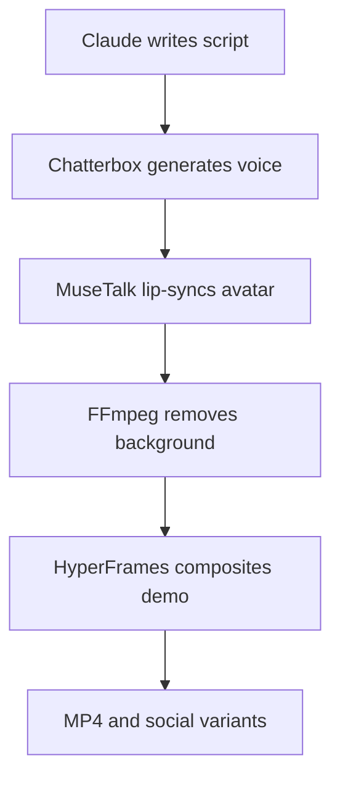

# Local Talking Video Avatar for Product Demos

> A practical implementation guide for adding a reusable, talking presenter to a Claude Code-driven DevRel and product-video pipeline.

- Guide version: 1.0
- Prepared: 2026-08-26
- Target platform: Ubuntu/Linux
- Primary stack: Claude Code + Chatterbox + MuseTalk + FFmpeg + HyperFrames/Remotion
- Primary use: documentation videos, DevRel walkthroughs, product launches and promotional demos

## 1. Recommended approach

Add an avatar-rendering stage to the existing video pipeline. For professional marketing output, do not generate the presenter from a single photograph for every video. Create a reusable avatar asset once, and then generate new speech and lip-sync it automatically.

Use this stack:

| Stage | Recommended tool |
| --- | --- |
| Script generation | Claude Code |
| Voice | Your recording or Chatterbox Multilingual |
| Presenter video | Reusable recorded performance plates |
| Lip synchronization | MuseTalk 1.5 |
| Background removal | Green screen plus FFmpeg chroma key |
| Composition | HyperFrames or Remotion |
| Final encoding | FFmpeg |
| Captions | Whisper or WhisperX |



## 2. Why reusable performance plates work best

A short prerecorded presenter video preserves real:

- Head and shoulder movement.
- Blinking and eye movement.
- Lighting and skin detail.
- Hair and clothing detail.
- Natural posture and body language.

MuseTalk changes the mouth region to match new audio while retaining most of the original presenter performance. This normally looks more professional than asking a model to generate the entire person, movement and speech from one static image.

[MuseTalk 1.5](https://github.com/TMElyralab/MuseTalk) supports reusable prepared avatars and accepts video or images plus audio. Its code and trained model are permitted for commercial use, subject to checking the licenses of its dependencies. Its documented minimum hardware test used a 4 GB NVIDIA GPU, although rendering was slow at that level.

## 3. Create reusable avatar plates

Record approximately eight to twelve short presenter clips:

```text
avatars/aitor/
├── neutral-front.mp4
├── explain-left.mp4
├── explain-right.mp4
├── enthusiastic.mp4
├── point-left.mp4
├── point-right.mp4
├── intro.mp4
├── conclusion.mp4
├── call-to-action.mp4
└── voice-reference.wav
```

Each clip should:

- Last approximately 8–20 seconds.
- Be recorded in 4K or 1080p at 25 fps.
- Use a fixed camera and consistent lighting.
- Use a green background if a transparent presenter is required.
- Keep hands and objects away from the mouth.
- Contain natural blinking and subtle movement.
- Avoid large head rotations.
- Leave visual space in the direction where the product UI will appear.
- Avoid logos, text or patterns that could shimmer after compression.

Useful performance categories include:

| Plate | Intended use |
| --- | --- |
| `intro` | Opening statement and problem framing |
| `neutral-front` | Direct explanations |
| `explain-left` | Presenter placed on the right, looking toward the UI |
| `explain-right` | Presenter placed on the left, looking toward the UI |
| `enthusiastic` | Launch announcement or key benefit |
| `point-left` | Calling attention to a feature on the left |
| `point-right` | Calling attention to a feature on the right |
| `conclusion` | Summary |
| `call-to-action` | Documentation link, signup or next step |

## 4. Scene manifest

Claude Code should choose a plate according to each section of the product story:

```yaml
video:
  id: agent-payment-demo
  title: Create an AI agent payment plan
  format: 16:9
  fps: 25

avatar:
  identity: aitor
  engine: musetalk-v1.5
  voice_engine: chatterbox-multilingual
  background: chroma-key

scenes:
  - id: intro
    type: avatar
    plate: intro
    script: >
      Let me show you how an AI agent can create a payment plan
      and start charging its customers.
    duration: auto
    placement: center

  - id: product-create-plan
    type: product-demo
    capture: create-payment-plan
    avatar:
      plate: explain-left
      placement: bottom-right
      width: 420
    script: >
      First, define the price and the number of credits included
      in the plan.

  - id: product-payment
    type: product-demo
    capture: complete-payment
    avatar: false

  - id: conclusion
    type: avatar
    plate: call-to-action
    script: >
      You can find the complete integration guide in our documentation.
    placement: center
```

## 5. Recommended editorial use

For a Project.co-style “show, don’t tell” presentation, restrict the avatar to:

- A 5–8 second introduction.
- One or two brief feature transitions.
- A final call to action.

Keeping the presenter over the product for the entire video makes the result feel more like a webinar and reduces the space available to show the UI. Product actions, title cards, callouts and animated focus areas should remain the main storytelling mechanism.

Good patterns include:

1. **Presenter introduction:** establish the problem and promise.
2. **Full-screen product demonstration:** show the workflow without obstruction.
3. **Presenter cutaway:** explain an important concept or benefit.
4. **Full-screen result:** show the completed outcome.
5. **Presenter call to action:** provide the next step.

## 6. Generate the voice locally

### Preferred choice: Chatterbox

[Chatterbox Multilingual](https://github.com/resemble-ai/chatterbox) supports local voice cloning, multilingual output and emotion control. It is MIT-licensed and intended to support commercial self-hosted use.

Record a clean, consented voice reference and generate:

```text
script.md
    ↓
voice.wav
    ↓
avatar-lipsynced.mp4
```

Recommended reference recording:

- 20–60 seconds of clean speech.
- No background music or room echo.
- Consistent microphone distance.
- Normal conversational delivery.
- Several representative phonemes and sentence types.
- A WAV original retained as the master asset.

Example delivery presets:

```yaml
voice_presets:
  documentation:
    exaggeration: 0.25
    pace: 0.96

  devrel:
    exaggeration: 0.40
    pace: 1.02

  promotion:
    exaggeration: 0.55
    pace: 1.06
```

### Lightweight alternative: Kokoro

[Kokoro](https://github.com/hexgrad/kokoro) is a smaller Apache-licensed TTS model. It is a good option when fast local generation is more important than cloning your own voice.

### Audio preparation

Retain a high-quality master audio file for the final mix, while creating a separate inference copy in the format required by the avatar engine:

```bash
ffmpeg \
  -i build/audio/scene-02-master.wav \
  -ac 1 \
  -ar 16000 \
  build/audio/scene-02-avatar.wav
```

Normalize the final voice track separately:

```bash
ffmpeg \
  -i build/audio/scene-02-master.wav \
  -af "loudnorm=I=-16:LRA=7:TP=-1.5" \
  -ar 48000 \
  build/audio/scene-02-final.wav
```

## 7. Generate the talking presenter with MuseTalk

MuseTalk prepares an avatar once and reuses it with different audio clips. The automation wrapper should manage:

1. Selecting the correct performance plate.
2. Matching, extending or looping the source plate to the audio duration.
3. Converting the source to 25 fps.
4. Creating the avatar inference audio.
5. Preparing a new avatar when it is used for the first time.
6. Reusing cached preparation data on subsequent renders.
7. Running MuseTalk.
8. Checking the output for mouth artifacts and synchronization.
9. Returning the rendered clip to the compositor.

Illustrative configuration:

```yaml
avatar_id: aitor-explain-left
video_path: assets/avatars/aitor/explain-left.mp4
audio_path: build/audio/scene-02-avatar.wav
result_dir: build/avatar/scene-02
version: v15
fps: 25
preparation: false
```

Illustrative invocation based on the MuseTalk CLI:

```bash
python -m scripts.realtime_inference \
  --inference_config configs/inference/realtime.yaml \
  --result_dir build/avatar/scene-02 \
  --unet_model_path models/musetalkV15/unet.pth \
  --unet_config models/musetalkV15/musetalk.json \
  --version v15 \
  --fps 25 \
  --skip_save_images
```

Pin the exact MuseTalk commit and model checksums in the production project. Test third-party dependency licenses before using generated clips commercially.

## 8. Plate-duration strategy

Repeated gestures are one of the easiest ways to make an avatar look artificial. Do not mechanically loop a single short clip for a long speech.

Preferred strategy:

1. Keep each avatar segment under 12 seconds.
2. Split longer narration around natural sentence boundaries.
3. Alternate compatible performance plates.
4. Insert full-screen product footage between presenter segments.
5. Apply short crossfades or product cutaways at loop boundaries.
6. Avoid reversing footage when it makes gestures look unnatural.

Claude Code can calculate the required duration from the synthesized audio and choose an appropriate plate before rendering.

## 9. Remove the background

For deterministic production, record against green rather than relying entirely on AI matting:

```bash
ffmpeg \
  -i build/avatar/scene-02-lipsynced.mp4 \
  -vf "chromakey=0x00FF00:0.14:0.08,format=yuva444p10le" \
  -c:v prores_ks \
  -profile:v 4 \
  build/avatar/scene-02-alpha.mov
```

The exact `chromakey` similarity and blend settings must be calibrated against the recorded background and lighting.

A transparent presenter can be:

- Placed over the product.
- Masked into a circle or rounded card.
- Given a subtle shadow.
- Animated into and out of the frame.
- Repositioned automatically to avoid relevant UI controls.

An easier alternative is to retain the recorded background and place the avatar inside a polished picture-in-picture card. This avoids hair-edge artifacts and often looks more deliberate.

## 10. Composition rules

Recommended defaults:

```yaml
avatar_composition:
  default_width: 420
  minimum_margin: 48
  corner_radius: 28
  shadow:
    blur: 28
    opacity: 0.22
    offset_y: 12
  entrance:
    type: slide-fade
    duration_frames: 12
  exit:
    type: fade
    duration_frames: 10
  safe_regions:
    - product-navigation
    - primary-action
    - captions
```

The scene manifest should record product focus regions. The compositor can then move the avatar to the opposite side automatically:

```yaml
focus:
  x: 0.68
  y: 0.42
  width: 0.24
  height: 0.18

avatar:
  avoid_focus: true
  preferred_positions:
    - bottom-right
    - bottom-left
    - top-right
```

## 11. Fully generated avatar from a photograph

If recording presenter plates is not possible, use an approved character image with audio-driven animation:

```text
Approved character image
        +
Generated speech
        ↓
Hallo2
        ↓
Talking portrait video
```

[Hallo2](https://github.com/fudan-generative-vision/hallo2) generates long-form portrait animation directly from a source image and audio. Its official setup was tested on NVIDIA A100 hardware with CUDA 11.8, it expects English audio, and its dependency licenses require review.

Use this route for:

- A stylized brand character.
- An illustrated developer mascot.
- An intentionally synthetic presenter.
- Short introductions or social clips.

Do not make this the default for a photorealistic company spokesperson. It is slower, less deterministic and more prone to uncanny expressions than a real performance plate.

## 12. Engine comparison

| Engine | Best use | Input | Important limitation |
| --- | --- | --- | --- |
| MuseTalk 1.5 | Reusable video avatar | Video/image plus audio | Official path is NVIDIA/CUDA-oriented |
| LatentSync 1.5 | Higher-quality video lip sync | Existing video plus audio | Approximately 8 GB minimum VRAM |
| LatentSync 1.6 | Improved 512×512 mouth rendering | Existing video plus audio | Approximately 18 GB minimum VRAM |
| LivePortrait | Applying head movement | Portrait plus driving video | Not directly audio-driven |
| Hallo2 | Still image to moving presenter | Image plus audio | Heavy, English-oriented and research-focused |
| Wav2Lip | Older experimental workflows | Existing video plus audio | Default repository is non-commercial |

[LatentSync](https://github.com/bytedance/LatentSync) is Apache-2.0 licensed. Version 1.5 documents an 8 GB minimum for inference; version 1.6 documents 18 GB.

[LivePortrait](https://github.com/KlingAIResearch/LivePortrait) is useful for motion transfer, but its repository warns that bundled InsightFace detection models are restricted to non-commercial research unless replaced.

[Wav2Lip](https://github.com/Rudrabha/Wav2Lip) should not be used for the commercial marketing pipeline under its repository's default non-commercial terms.

## 13. AMD GPU constraint

An AMD RX 9060 XT has useful memory capacity, but the official MuseTalk, LatentSync and Hallo2 installation paths are CUDA/NVIDIA-oriented. MuseTalk also depends on components such as MMCV, which make an unofficial ROCm conversion more complicated than installing a standard PyTorch ROCm package.

Do not make an unofficial ROCm port the initial production baseline. Instead, define an engine adapter:

```ts
export interface AvatarRenderer {
  prepareAvatar(input: AvatarSource): Promise<PreparedAvatar>;

  render(input: {
    avatarId: string;
    audioPath: string;
    outputPath: string;
  }): Promise<RenderedClip>;
}
```

Suggested adapters:

```text
avatar-engine/
├── musetalk-local-nvidia.ts
├── latentsync-local-nvidia.ts
├── remote-gpu.ts
└── commercial-api.ts
```

This allows Claude Code to orchestrate everything locally while the GPU-heavy avatar stage runs on:

1. A local NVIDIA machine.
2. An NVIDIA machine on the local network.
3. A temporary remote GPU container.
4. A hosted avatar API.

Scripts, product captures, composition, review and final encoding can remain local.

## 14. Suggested project structure

```text
devrel-video-studio/
├── .claude/
│   └── skills/
│       └── devrel-video/
├── assets/
│   └── avatars/
│       └── aitor/
│           ├── plates/
│           ├── voice-reference.wav
│           └── avatar.yaml
├── projects/
│   └── agent-payment-demo/
│       ├── video.yaml
│       ├── script.md
│       └── review.md
├── packages/
│   ├── avatar-engine/
│   ├── voice-engine/
│   ├── compositor/
│   └── qa/
├── build/
│   ├── audio/
│   ├── avatar/
│   ├── capture/
│   ├── composition/
│   └── final/
└── scripts/
    ├── prepare-avatar.ts
    ├── synthesize-voice.ts
    ├── render-avatar.ts
    ├── chroma-key.sh
    ├── compose-video.ts
    └── validate-video.sh
```

## 15. Claude Code orchestration flow

The DevRel video skill should add these phases:

1. **Avatar direction**
   - Decide whether a presenter materially improves the video.
   - Select introduction, transition and CTA scenes.
   - Choose placement and performance plates.

2. **Script preparation**
   - Write short, spoken sentences.
   - Add pauses and pronunciation hints.
   - Validate product claims.

3. **Voice generation**
   - Synthesize one file per scene.
   - Normalize volume.
   - Measure duration.

4. **Avatar rendering**
   - Select or prepare the avatar.
   - Generate lip synchronization.
   - Apply chroma key or picture-in-picture styling.

5. **Composition**
   - Place the avatar without obscuring UI focus regions.
   - Add title cards, product capture, captions and music.

6. **Quality review**
   - Inspect lip sync, eye motion, hair edges, gestures and cuts.
   - Reject clips with facial distortion or repeated unnatural movement.

7. **Final encoding**
   - Mix the high-quality voice master, rather than the low-rate inference copy.
   - Render documentation and social variants.

## 16. Avatar quality gates

Each generated avatar segment should pass:

- No visible mouth-mask boundary.
- Teeth and lips remain stable between frames.
- Speech timing feels synchronized.
- Identity, facial hair and lip color remain consistent.
- No hand or object crosses the synthesized mouth region.
- Blinking and head movement remain natural.
- No obvious loop boundary appears.
- Hair edges and clothing edges are clean after keying.
- Avatar never covers the demonstrated product action.
- Captions do not overlap the avatar.
- Voice level remains consistent across scenes.
- Music never masks speech.
- The avatar identity and voice have explicit usage consent.

For automated QA, generate:

- A contact sheet sampled every second.
- A short low-resolution review proxy.
- An `ffprobe` metadata report.
- A waveform or silence report.
- A transcript comparison against the approved script.

## 17. Safety, consent and disclosure

- Use only a face and voice for which the company has explicit permission.
- Keep the original consent and approved-use record with the avatar metadata.
- Never imitate employees, customers, public figures or partners without authorization.
- Clearly identify a fictional or synthetic spokesperson when viewers could reasonably mistake it for a real person.
- Do not use third-party repository test footage in commercial output.
- Audit the code, model, dataset and dependency licenses separately.
- Retain model versions and checksums for reproducible renders.
- Store voice references and source recordings as sensitive media assets.
- Review local laws and platform rules before publishing synthetic-person content.

Example metadata:

```yaml
identity: aitor
type: real-consented-presenter
consent:
  recorded: true
  voice_clone: true
  commercial_marketing: true
  documentation: true
source_owner: company
approved_engines:
  - chatterbox-multilingual
  - musetalk-v1.5
```

## 18. Recommended first implementation

Start with:

- Your own consented face and voice.
- Six to ten prerecorded green-screen performance plates.
- Chatterbox for local voice generation.
- MuseTalk 1.5 for lip synchronization.
- FFmpeg for audio preparation, chroma key and encoding.
- HyperFrames or Remotion for composition.
- Avatar only in the introduction, transitions and CTA.
- A provider abstraction because the AMD GPU is not an officially supported MuseTalk target.

The first proof of concept should be a 45–60 second video containing:

1. One 6-second presenter introduction.
2. Approximately 35–45 seconds of full-screen product demonstration.
3. One brief avatar transition if necessary.
4. One 5-second presenter CTA.

Do not introduce voice cloning, multiple languages, fully generated characters and several avatar engines simultaneously. Validate one identity, one voice, one video format and one product workflow first.

## 19. Acceptance criteria

The initial avatar subsystem is complete when:

1. Claude Code can select an avatar plate from the project manifest.
2. A script can be converted to local speech automatically.
3. A prepared avatar can be reused without repeating all preprocessing.
4. A new audio track can be lip-synced to the selected plate.
5. The avatar background can be removed or framed consistently.
6. The compositor can position the avatar according to UI focus regions.
7. The final video uses the high-quality voice master.
8. Documentation and marketing output profiles render successfully.
9. A review proxy and contact sheet are produced automatically.
10. Licensing and consent metadata are stored for every avatar identity.
11. The complete render can be reproduced from a manifest.
12. An avatar engine can be replaced without changing the composition layer.

## 20. Example Claude Code command

```text
/devrel-video create \
  --project agent-payment-demo \
  --mode devrel \
  --avatar aitor \
  --avatar-scenes intro,transition,cta \
  --voice chatterbox \
  --avatar-engine musetalk-v1.5 \
  --format 16:9 \
  --duration 60s
```

Expected behavior:

1. Inspect the product project and brand profile.
2. Draft the product story and spoken script.
3. Ask for approval before rendering expensive avatar stages.
4. Generate scene audio and calculate duration.
5. Select performance plates.
6. Render and key the avatar segments.
7. Capture the product workflow.
8. Compose the final video.
9. Generate review artifacts.
10. Render final outputs after approval.

## 21. Sources

- MuseTalk: <https://github.com/TMElyralab/MuseTalk>
- Chatterbox: <https://github.com/resemble-ai/chatterbox>
- Kokoro: <https://github.com/hexgrad/kokoro>
- LatentSync: <https://github.com/bytedance/LatentSync>
- LivePortrait: <https://github.com/KlingAIResearch/LivePortrait>
- Hallo2: <https://github.com/fudan-generative-vision/hallo2>
- Wav2Lip: <https://github.com/Rudrabha/Wav2Lip>
- FFmpeg: <https://ffmpeg.org/>

---

The strongest production baseline is a real, reusable presenter plate combined with generated speech and localized lip synchronization. It provides substantially better control and consistency than regenerating an entire photorealistic human for each scene.
